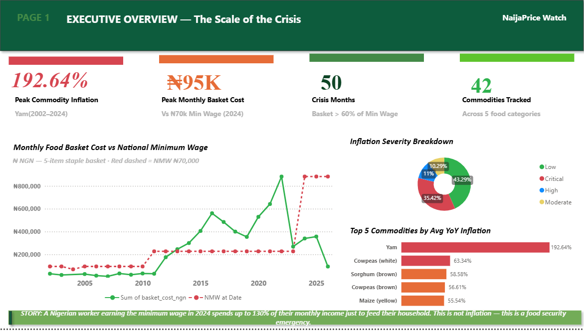
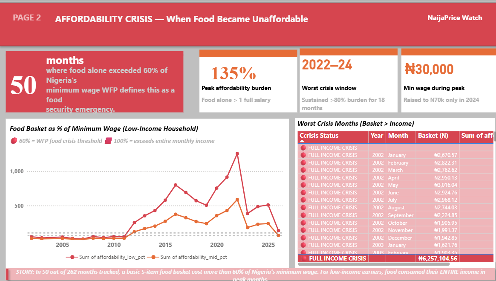
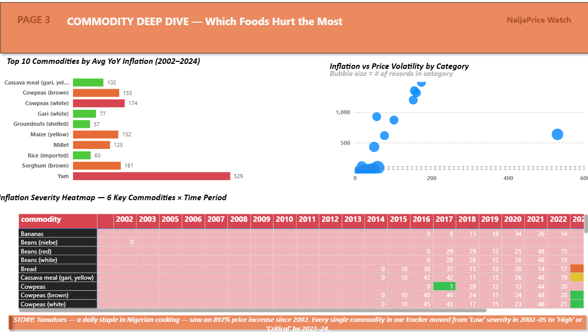

# NaijaPrice Watch 🇳🇬

> A production-grade data engineering pipeline tracking 22 years of food price inflation in Nigeria and its impact on household affordability.


---

## What This Project Does

NaijaPrice Watch is an end-to-end data engineering pipeline that processes **87,325 raw records** from the UN World Food Programme’s Nigeria price monitoring dataset.

It transforms raw market data into analytical insights using a 4-stage ETL pipeline, enriches it with macroeconomic indicators (exchange rates + CPI), and delivers an interactive Power BI dashboard.

The core question:

> Can a minimum-wage Nigerian household afford basic nutrition?

The analysis shows that in **50 out of 262 months**, food costs exceeded a significant portion of monthly income.

---

## Key Findings

| Metric                              | Value                    |
|-------------------------------------|--------------------------|
| Raw rows ingested                  | 87,325                   |
| Clean monthly records              | 5,136                    |
| Commodities tracked                | 43                       |
| Date range                         | Jan 2002 – Apr 2026      |
| Crisis months (>60% NMW)           | 50 months                |
| Months food exceeded income        | 8 months                 |
| Peak basket cost                   | ₦94,675 (Jan 2023)       |
| Peak affordability burden          | 135.2% of NMW            |
| Pipeline runtime                   | 2.3 seconds              |

In January 2023, a basic food basket cost ₦94,675 against a minimum wage of ₦30,000 — meaning food alone consumed **135% of monthly income**.

---
## Dashboard Preview






> > Full interactive dashboard: open `dashboard/shop_watch_final_pp.pbix` in Power BI Desktop (Windows)
> PDF version (viewable on any device): `shop_watch_final_pp.pdf`


>
> ---
## Pipeline Architecture

**1. Extract**
- WFP food price dataset (87,325 rows)
- Live FX rates API
- World Bank CPI (29 years)

**2. Transform**
- Data cleaning & deduplication
- Monthly aggregation
- MoM% and YoY% calculations
- 3-month rolling averages
- Inflation severity classification
- Affordability index creation

**3. Validate**
- Schema validation
- No negative prices
- No duplicate (commodity, date)
- Missing value audit

**4. Load**
- Exported Power BI-ready datasets
- Structured logs saved to `/logs`

---

## Top Commodities by Inflation (YoY Avg)

1. Yam — 218.9%  
2. Cowpeas (white) — 173.9%  
3. Sorghum (brown) — 160.8%  
4. Cowpeas (brown) — 155.4%  
5. Maize (yellow) — 152.5%  

These represent essential staples in Nigerian households, not luxury goods.

---

## Worst Crisis Months (Food vs Income)

- Jan 2023 — ₦94,675 — 135.2% of NMW  
- Dec 2022 — ₦93,530 — 133.6%  
- Nov 2022 — ₦91,934 — 131.3%  
- Oct 2022 — ₦86,149 — 123.1%  
- Sep 2022 — ₦83,674 — 119.5%  

---

## Data Quality Notes

- Initial MoM and rolling metrics contain structural nulls (expected at series start)
- YoY calculations contain 509 nulls due to first-year lag per commodity
- All prices validated to be > 0
- No duplicate (commodity, date) records detected
- Some regional data (e.g., Yam – Abuja) is sparse and should be interpreted cautiously

---

## Tech Stack

Python · Pandas · NumPy · REST APIs · PostgreSQL · Power BI (DAX) · Git

---

## How to Run

```bash
git clone https://github.com/Trigonx1/NaijaPrice-Watch
pip install -r requirements.txt
jupyter notebook final_shop_watch.ipynb
